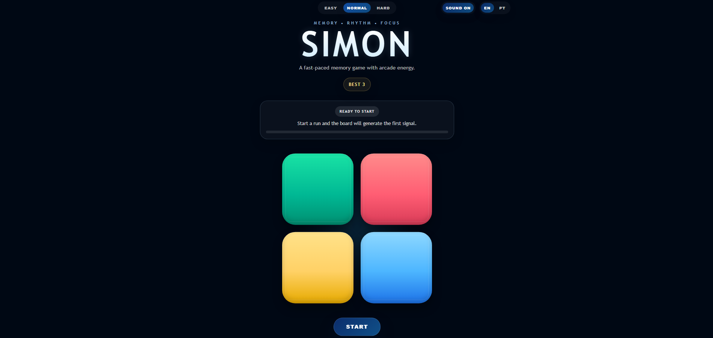
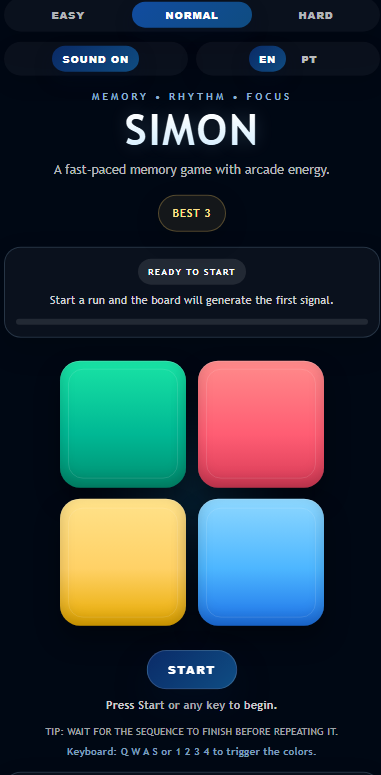

# Simon Game

Simon Game is a portfolio-ready memory game built with React and Vite. The player must watch, memorize, and reproduce an increasingly longer sequence of colors.

---

## PT-BR

### Visão Geral

Este projeto é uma releitura moderna do clássico Simon Game, desenvolvida com foco em qualidade de interface, organização de código e experiência do usuário.

Mais do que reproduzir a mecânica do jogo, a proposta foi construir uma aplicação com acabamento de portfólio, incluindo acessibilidade, responsividade, microinterações, persistência local e testes automatizados.

### Demo

Versão online:  
https://simon-game-react-nine.vercel.app/

### Screenshot




### Destaques Para Recrutadores

- Interface moderna com foco em hierarquia visual e microinterações
- Lógica do jogo isolada em hook customizado
- Persistência local com `localStorage`
- Suporte a acessibilidade e navegação por teclado
- Modos de dificuldade e leaderboard local
- Testes automatizados cobrindo fluxos principais

### Funcionalidades

- Sequência aleatória progressiva
- Feedback visual e sonoro para cada cor
- Estados de jogo claros: início, reprodução, turno do jogador e game over
- High score persistido localmente
- Leaderboard local com top 5
- Modos `easy`, `normal` e `hard`
- Alternância de idioma entre PT-BR e EN
- Toggle de som
- Suporte a teclado nas cores e navegação acessível
- Layout responsivo para mobile e desktop

### Stack

- React
- Vite
- JavaScript
- CSS
- Vitest
- Testing Library

### Deploy

Adicione o link da versão publicada aqui.

Exemplo:

```md
[Ver projeto online](https://seu-link-aqui.com)
```

### Qualidade Técnica

- Componentes separados por responsabilidade
- Hook `useSimonGame` concentrando a regra principal do jogo
- Constantes centralizadas
- Feedback de interface orientado por estado
- Testes para:
  - início de jogo
  - avanço de fase
  - erro do jogador
  - restart

### Estrutura

```text
src/
  components/
  constants/
  hooks/
  test/
```

### Como Rodar

```bash
npm install
npm run dev
```

### Scripts

```bash
npm run dev
npm run build
npm run lint
npm test
```

### Objetivo do Projeto

Este projeto foi desenvolvido para demonstrar:

- domínio de React com hooks
- organização de interface em componentes reutilizáveis
- atenção a UX/UI
- preocupação com acessibilidade
- cuidado com qualidade de código e testes

### Contato e Links

- LinkedIn: https://www.linkedin.com/in/tamirisfreis/
- GitHub: https://github.com/tamicoding

---

## EN

### Overview

This project is a modern take on the classic Simon Game, built with a strong focus on interface quality, code organization, and user experience.

Beyond reproducing the game mechanics, the goal was to deliver a portfolio-quality application with accessibility, responsiveness, microinteractions, local persistence, and automated tests.

### Demo

Live version:  
https://simon-game-react-nine.vercel.app/

### Screenshot


### Recruiter Highlights

- Modern interface with strong visual hierarchy and microinteractions
- Game logic isolated in a custom hook
- Local persistence with `localStorage`
- Accessibility and keyboard support
- Difficulty modes and local leaderboard
- Automated tests covering core flows

### Features

- Progressive random color sequence
- Visual and audio feedback for each color
- Clear game states: start, sequence playback, player turn, and game over
- Persistent high score
- Local top 5 leaderboard
- `easy`, `normal`, and `hard` difficulty modes
- PT-BR / EN language switch
- Sound toggle
- Direct keyboard controls for the pads and accessible navigation
- Responsive layout for mobile and desktop

### Stack

- React
- Vite
- JavaScript
- CSS
- Vitest
- Testing Library

### Deploy

Add the live project link here.

Example:

```md
[Live demo](https://your-link-here.com)
```

### Technical Quality

- Components organized by responsibility
- `useSimonGame` custom hook handling the core game rules
- Centralized constants
- State-driven UI feedback
- Tests covering:
  - game start
  - level progression
  - wrong input
  - restart

### Structure

```text
src/
  components/
  constants/
  hooks/
  test/
```

### Running Locally

```bash
npm install
npm run dev
```

### Scripts

```bash
npm run dev
npm run build
npm run lint
npm test
```

### Project Goal

This project was built to demonstrate:

- solid React and hooks knowledge
- reusable component architecture
- attention to UX/UI details
- accessibility awareness
- care for code quality and testing

### Contact and Links

- LinkedIn: https://www.linkedin.com/in/tamirisfreis/
- GitHub: https://github.com/tamicoding

---

## Author

Built by Tamiris Reis.
